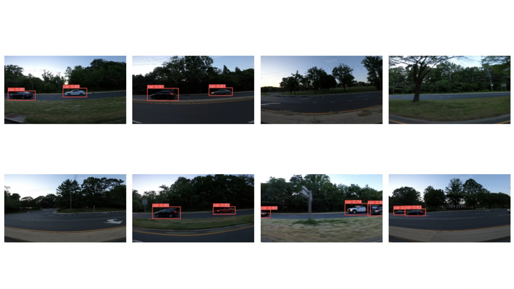
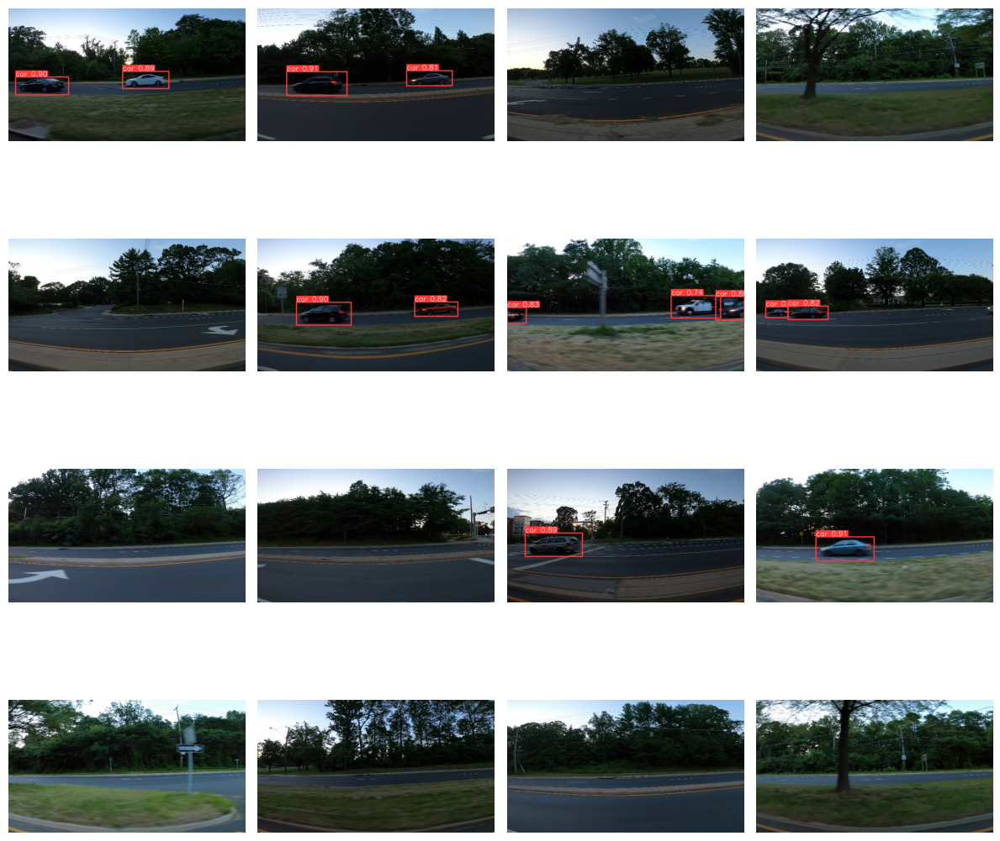

# YOLOv8 Car Object Detection

This repository provides scripts for training and evaluating YOLOv8 models on a car-object detection dataset. The project is built using the Ultralytics YOLOv8 library and integrates with WandB for experiment tracking.



## Setup

### Installation

1. Clone the repository:

   ```bash
   git clone https://github.com/your-username/yolov8-car-object-detection.git
   cd yolov8-car-object-detection
   ```

2. Install dependencies:

   ```bash
   pip install -r requirements.txt
   ```

3. Download the car-object-detection dataset on google drive and extract:

   [Car Object Detetion Dataset](https://drive.google.com/drive/folders/19K_94Op1Pl6p0Qcb0mOi9GAyPs4yFI1K?usp=sharing)

4. Configure your WandB API key:

   Open `config.conf` and replace `YOUR WANDB KEY` with your actual WandB API key. Replace {/path/to/data}/car-object-detection with data path downloaded above.

## Training

To train the YOLOv8 model, run:

```bash
python trainer.py
```

Adjust the configuration in `config.conf` to suit your needs.

## Evaluation

To evaluate the trained model and visualize predictions, run:

```bash
python evaluate.py --yolo_model runs/detect/train/weights/best.pt --testing_paths "runs/detect/predict"
```

Replace `yolov8m.pt` with the desired trained model weights file.

## Directory Structure

- `data`: Directory for storing the car-object-detection dataset.
- `runs`: Directory for storing training and evaluation results.

## Evaluate Result


## Acknowledgments

- [Ultralytics YOLO](https://github.com/ultralytics/ultralytics)
- [WandB](https://wandb.ai/)
